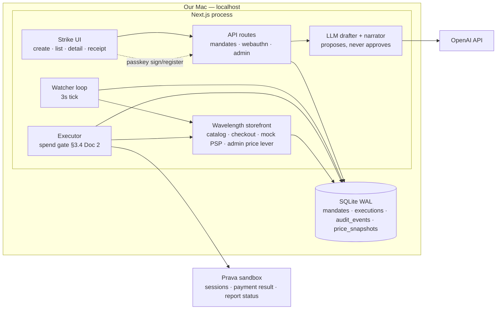

# Doc 3 — Architecture

> One machine, one process, one language. Every distributed-systems problem we can delete, we delete.
> Status: FROZEN pending approval · Depends on: Docs 1–2 · Last updated: 2026-07-23

## 1. Stack

| Layer | Choice | Why |
|---|---|---|
| App framework | **Next.js 15 (App Router) + TypeScript** | UI, API routes, watcher, executor, and the mock storefront in one repo/process. Solo builder ⇒ one language, one dev server, one thing to restart on stage. |
| WebAuthn | **@simplewebauthn** (browser + server) | Best-maintained passkey library; handles clientDataJSON parsing, COSE keys, origin checks. |
| DB | **SQLite (better-sqlite3 + Drizzle ORM)**, WAL mode | Local demo (Doc 1). Synchronous transactions make the CAS trigger-lock trivial and testable. Drizzle schema is `CREATE TABLE`-portable to Postgres — "migration-ready" per Doc 4. |
| LLM | **OpenAI Responses API**, structured outputs (strict JSON schema), model via `OPENAI_MODEL` env (mini-class default) | Drafting + narration only (§5). |
| Styling | Tailwind + shadcn/ui | Doc 5 carries the design system; these are the primitives. |
| Payments | **Prava sandbox REST + embedded SDK** | §6. The only network dependency besides OpenAI. |

**Rejected alternatives** (one line each, so we never re-litigate at 2am):
- *FastAPI + React* — two runtimes, CORS, duplicated types; solo team pays double tax. 
- *Separate worker process* — real ops answer at scale, but locally it's a second thing to crash; in-process loop + DB locks give the same guarantees here.
- *Prava Pay CLI/MCP* — **no sandbox; live cards** (Doc 1). Rejected for demo safety, referenced in the pitch as the production path.
- *LLM-driven checkout agent* — puts a stochastic component inside the money path; the thesis is that the money path is boring, deterministic code.
- *Webhooks from merchant → watcher* — only works because we own the merchant; polling is the honest general mechanism (§3).
- *Postgres + Redis queue* — infra theater for one user and two background loops.

## 2. Components

Trust boundary: **only `X` (executor) may call Prava**, and only after re-running the Doc 2 §3.4 verification gate. `LLM` has no imports from and no code path into `X` — enforced by convention #2 in CLAUDE.md and a lint boundary (`eslint-plugin-boundaries`: `llm/` may not be imported by `executor/`).

## 3. Watching conditions

- **Mechanism: polling.** The watcher ticks every **3 s**, fetching `GET /store/api/products/:sku` through a `PriceSource` adapter interface (`WavelengthAdapter` today; an adapter per merchant later). Each observation is written to `price_snapshots` — the audit trail shows the actual watch loop, which is itself a demo asset.
- **Tradeoff, stated for judges:** webhooks are instant but exist only where merchants offer them; polling works against any priceable surface. Production tiers the cadence (hot mandates seconds, cold ones minutes) and swaps in webhooks per adapter where available. At demo scale (1 SKU, 3 s) cost is zero and worst-case stage latency is ~3 s — invisible.
- **Where it runs:** inside the Next.js Node runtime, started once from `instrumentation.ts`. A **leader lease row** in SQLite (id=1, holder, heartbeat, 10 s TTL) guards against double loops after hot-reload — a second starter sees a fresh heartbeat and stands down.
- **Duplicate firing:** the lease is hygiene; the real lock is data-level (Doc 2 §5): `UPDATE mandates SET status='triggered' WHERE id=? AND status='armed'` — rowcount 1 wins, 0 is a no-op — then `INSERT INTO executions` with `UNIQUE(mandate_id)`. Two locks, both in SQLite, both survive any number of racing loops.

## 4. Execution & idempotency, end to end

1. Trigger CAS wins → `executions` row created; **`execution_id` is the idempotency key for everything downstream.**
2. Executor runs the spend gate (re-verify signature, status, expiry, revocation, live re-quote ≤ cap — Doc 2 §3.4). Abort ⇒ re-arm per failure matrix.
3. **Line P (`PRAVA_MODE=mandate`):** `POST /v1/mandates/{prava_mandate_id}/charge` with `amount` = exact quote total and `reference` = `execution_id`. **Synchronous** — the response returns the single-use `credentials` (token, `dynamicCvv`, expiry) *and* a `deduplicated` flag; there is no separate poll. Retries (×2, backoff, 5xx only) resend the same `reference` — Prava dedupes, no double charge. (`prava_mandate_id` was created + passkey-approved at arm time, Doc 2 §7.)
4. Credentials arrive **with** the charge response (no poll step). Held in memory only — never written to DB or logs; the store checkout consumes them immediately.
5. **Line C:** `POST /store/api/checkout` with credentials + `Idempotency-Key: execution_id`; the store dedupes on it, so a crash-retry cannot double-order.
6. Report `APPROVED`/`DECLINED` to Prava; mark `fulfilled`/`failed`; audit each step (same-transaction rule, Doc 2 §4).

**Restart recovery** (runs on boot, before the watcher starts): scan `executing` rows — no charge issued (no Prava `transactionId` recorded) ⇒ re-arm (nothing engaged); charge issued but no checkout ⇒ re-issue with the same `reference` (idempotent — Prava returns the original, `deduplicated:true`) and resume at Line C; checkout submitted ⇒ reconcile against the store's order table and Prava status, then finalize. State machine + idempotency keys mean **restart at any line of the executor is safe** — Doc 1 success criterion 6, and we demo it in rehearsal by `kill -9`-ing mid-execution.

## 5. Where the LLM sits — and where it cannot

| LLM does | LLM cannot |
|---|---|
| Parse "buy the AirPods Pro under $180 before Friday" → `MandateDraft` JSON (strict structured output) | Sign anything (only the passkey does) |
| Write the human-readable audit narration on the detail screen | Trigger, approve, or execute a spend |
| — | Call Prava, the store checkout, or mutate mandate state (no such tools exist in its context) |

The draft flows: LLM proposal → **Zod validation** (rejects `fare_below`, absurd caps, past expiry) → user reviews the scope card → **passkey signs the canonical bytes** (Doc 2 §3.2). A hallucinated price cap is caught by the human at review or is simply what the user then signs — either way the LLM never had authority, because authorization *is* the signature over bytes the user saw. On-stage line: *"the model proposes; the passkey disposes."*

## 6. Prava integration surface

Everything Prava lives in **one module: `src/lib/prava.ts`** — typed client, 10 s timeouts, redacted request/response logging to `audit_events`, errors mapped to failure-matrix reasons.

| Call | Used for | If it misbehaves at 2am |
|---|---|---|
| `POST /v1/sessions` **+ `mandate_setup`** (sk key) | **Arm time:** create the one-time mandate — pin merchant (`scope: listed`), `amount` cap, ≤7-day expiry; returns an approval URL | 4xx surfaces at *setup*, never at execution; retry ×2 on 5xx. |
| Poll mandate → `active` (List/Get Mandate) | **Arm time:** confirm the user's passkey approval landed before flipping to `armed` | Not-yet-active ⇒ stay `signed`, block arming — never blocks execution of an already-armed mandate. |
| `POST /v1/mandates/{id}/charge` (sk key) | **Line P:** synchronous mint, `reference`=`execution_id`; credentials returned inline | Retry ×2 on 5xx (same `reference`). `MANDATE_NOT_ACTIVE`/`MANDATE_EXPIRED`/4xx ⇒ `failed(prava_declined)`. `THRESHOLD_EXCEEDED` = Beat 5, expected. Shape drift ⇒ fix in one file. |
| Report charge (`/v1/mandates/{id}/report`) | Close the loop APPROVED/DECLINED | Fire-and-retry; a failure here never blocks the order (log + flag). |
| Mandate lifecycle (pause/cancel) / revoke | Abort after Line P; revoke-mandate is the decline-beat fallback | Best-effort; the one-time mandate self-consumes/expires anyway. |
| List cards / SDK `collectPAN` | **Setup:** enroll the sandbox test card that backs the mandate | Cache at boot; if down, blocks setup only, never execution. |
| Guardrails — the mandate `amount` cap **is** the guardrail | Beat 5: an over-cap charge is refused with `THRESHOLD_EXCEEDED` | RESOLVED from docs (Doc 2 A2). M1 confirms with a live over-cap charge; no separate wallet cap to configure. |

## 7. Demo mode — deterministic drop, real payments

- **The lever:** `POST /store/admin/price {sku, price_cents}` behind an admin cookie, with a big red button on `/store/admin`. Clicking it updates the DB price; the watcher notices on its next 3 s tick. Nothing about Strike knows the lever exists — the watcher reads the same product API any adapter would.
- **The decline beat (Beat 5), with a real refusal:** the mandate's own **`amount` cap is the guardrail** — nothing extra to configure. On stage, `DEMO_BYPASS_GATE` (compiled out unless `DEMO=1`) skips *our* app-layer cap check and issues a charge **above the mandate cap**; Prava refuses to mint: `status:"failed"`, `errorMessage:"THRESHOLD_EXCEEDED"` — a real card-network refusal with our own code as the attacker. Fallbacks (all real Prava errors, none faked): a listed-scope violation (`MANDATE_MERCHANT_NOT_ALLOWED`, 403), or charging a `consumed`/revoked mandate (`MANDATE_NOT_ACTIVE`, 409).
- **Reset:** `/store/admin` also has "Reset demo" — price back to $199, demo mandates cleared, executions archived. Rehearsable end-to-end in under a minute.
- **What is never simulated:** session creation, passkey prompts, token minting, status reporting. If Prava sandbox is down at demo time, we play the backup video (Doc 1) — we do not stub the payment.

## Assumptions

- **A1:** RESOLVED — the money-moving call is `POST /v1/mandates/{id}/charge`, which takes a `reference` idempotency key (≤255 chars) and returns a `deduplicated` flag; `execution_id` maps to `reference` directly. (Plain `POST /v1/sessions` has no idempotency header, but the money path never uses a bare session — only `mandate_setup` at arm time and `charge` at execution.)
- **A2:** RESOLVED (from docs) — Beat 5's refusal is the **mandate `amount` cap**: an over-cap charge returns `THRESHOLD_EXCEEDED`. No separate wallet cap needed. Fallbacks: `MANDATE_MERCHANT_NOT_ALLOWED` (listed-scope) or `MANDATE_NOT_ACTIVE` (consumed/revoked). To confirm with fixtures in M1.
- **A3:** OpenAI key is ours (personal); if the venue provides credits/endpoint we swap `OPENAI_BASE_URL`. A canned-draft fixture (`LLM_MODE=fixture`) exists so the demo survives an OpenAI outage.
- **A4:** Venue internet or phone hotspot suffices for two HTTPS APIs. Rehearsal includes one full run on the hotspot.
- **A5:** Single demo user seeded at boot; no auth beyond a session cookie + the registered passkey.
